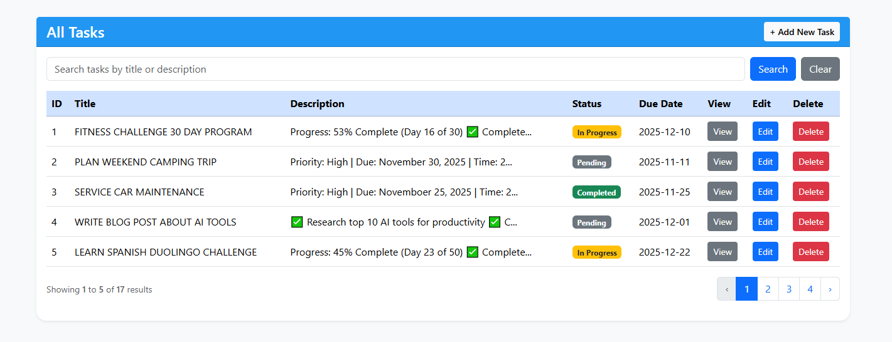
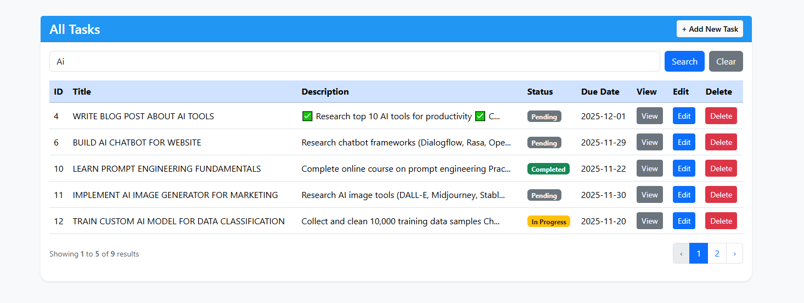
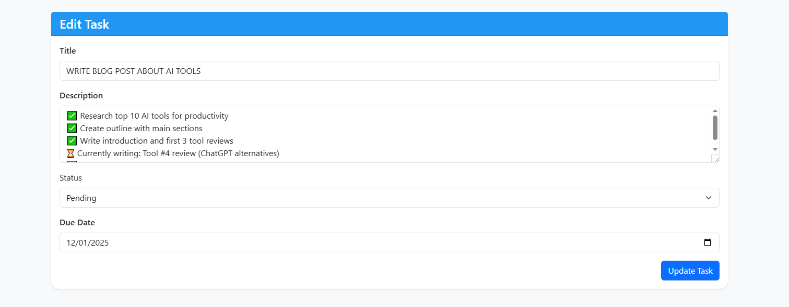
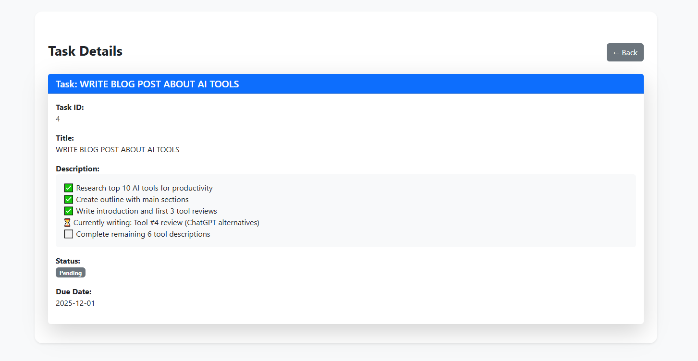

# Laravel CRUD Task App

A clean and simple **Task Management System** built with **Laravel 12.37.0**, using **Eloquent ORM**, **Blade**, and **Bootstrap**.  
This project demonstrates my practical skills in CRUD operations, validation, pagination, search, flash messages, and clean MVC architecture.

---

## 📸 Screenshots






---

## 🚀 Features

- **Eloquent ORM CRUD**  
- **Create / Edit / View / Delete Task**  
- **Form Validation**  
- **Pagination**  
- **Search & Filter**  
- **Flash Success/Error Messages**  
- **Bootstrap Responsive UI**  
- **Clean MVC Folder Structure**

---

## 🛠️ Technologies Used

- Laravel **12.37.0**  
- PHP 8+  
- MySQL  
- Blade Templating  
- Bootstrap 5  
- Composer  

---

## ⚙️ Installation Guide

Follow the steps below to run this project locally:

```bash
# Clone the repository
git clone https://github.com/riaz6001/laravel-crud-task-app.git

# Move into the project folder
cd laravel-crud-task-app

# Install dependencies
composer install

# Copy .env file
cp .env.example .env

# Generate application key
php artisan key:generate

# Create database and update .env with your DB credentials

# Run migrations
php artisan migrate

# Start the local server
php artisan serve


Your app will be available at:
http://127.0.0.1:8000
---

# 📂 Project Structure
app/
 ├── Http/
 │    ├── Controllers/
 │    ├── Requests/
 ├── Models/
resources/
 ├── views/
 │    ├── home.blade.php
routes/
 ├── web.php
public/
 ├── css/
 ├── js/

## 🔍 Search & Filter Example

Your search or filter route might look like:

Route::get('/tasks/search', [TaskController::class, 'search'])->name('tasks.search');

🧪 Flash Messages Example
return redirect()->route('tasks.index')->with('success', 'Task created successfully!');

## 🧑‍💻 Author

Mostafizur Rahman
Laravel Developer (Beginner → Intermediate)
📩 Email: your-email@example.com

🔗 LinkedIn: your-linkedin-url
🔗 Portfolio (optional): your-portfolio-url

📜 License

This project is open-sourced under the MIT License.
